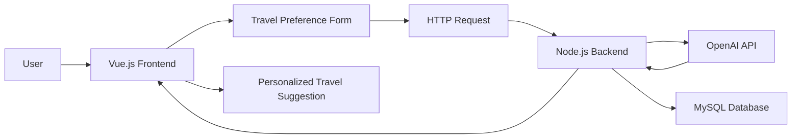

# Trip Suggestion Web Application

<p align="center">
  
  
  
  
  
</p>

## Overview

Trip Suggestion Web Application is a full-stack travel recommendation platform designed to help users generate personalized trip suggestions based on their preferences. The application collects user inputs such as age range, travel style, group type, preferred sport activity, and estimated budget, then sends these inputs to an AI-powered backend service to generate tailored travel ideas.

The project was developed as a web-based travel planning assistant with a modern frontend interface, backend API communication, database connection support, and OpenAI-based recommendation generation.

## Key Features

- Personalized travel suggestion generation based on user preferences
- AI-supported recommendation engine using OpenAI API
- User-friendly and responsive web interface
- Sign-in and registration interface design
- Questionnaire-based travel preference collection
- Frontend-backend communication through HTTP requests
- MySQL database connection support
- Environment-based API key management with `.env`

## Project Scope

The main goal of this project is to make travel planning easier, faster, and more personalized. Instead of presenting static travel options, the system collects user-specific information and generates dynamic recommendations according to the selected preferences.

The application focuses on the following user inputs:

| Input | Description |
|---|---|
| Age range | User's age category |
| Travel preference | Preferred destination or travel style |
| Group type | Solo, family, friends, or tour-based travel |
| Sport activity | Trekking, skiing, swimming, or rafting |
| Budget | Estimated travel budget |

## Tech Stack

### Frontend

- Vue.js 3
- Vite
- Vue Router
- Vuetify
- Axios
- HTML / CSS / JavaScript

### Backend

- Node.js
- Native HTTP server
- OpenAI API
- MySQL
- dotenv

### Database

- MySQL

## System Architecture



## Application Workflow

1. The user opens the web application.
2. The user can navigate through the homepage, sign-in page, registration page, and suggestion page.
3. On the suggestion page, the user answers travel-related questions.
4. The frontend sends the selected preferences to the backend.
5. The backend creates a structured prompt using the user inputs.
6. The OpenAI API generates a personalized travel recommendation.
7. The recommendation is returned to the frontend and displayed to the user.

## API Endpoint

### Generate Travel Suggestion

```http
POST /generate_suggestion
```

### Request Body

```json
{
  "age": "26-35",
  "type": "option2",
  "size": "family",
  "sport": "rafting",
  "budget": 5000
}
```

### Response Example

```json
{
  "suggestion": "Personalized travel recommendation text generated according to the user's preferences."
}
```

## Project Structure

```text
trip-suggestion-web-app/
│
├── backend/
│   ├── hello.js
│   ├── package.json
│   └── package-lock.json
│
├── frontend/
│   ├── public/
│   ├── src/
│   │   ├── assets/
│   │   ├── plugins/
│   │   ├── public/
│   │   ├── App.vue
│   │   ├── askForaSuggestion.vue
│   │   ├── homePage.vue
│   │   ├── main.js
│   │   ├── register.vue
│   │   ├── router.js
│   │   ├── signIn.vue
│   │   └── style.css
│   │
│   ├── index.html
│   ├── package.json
│   ├── package-lock.json
│   ├── postcss.config.cjs
│   └── vite.config.js
│
├── .gitignore
└── README.md
```

## Installation and Setup

### Prerequisites

Make sure the following tools are installed on your system:

- Node.js
- npm
- MySQL
- OpenAI API key

## Backend Setup

Navigate to the backend directory:

```bash
cd backend
```

Install dependencies:

```bash
npm install
```

Create a `.env` file in the `backend` directory:

```env
OPENAI_API_KEY=your_openai_api_key_here
```

Start the backend server:

```bash
npm start
```

By default, the backend server runs on:

```text
http://127.0.0.1:3000
```

## Frontend Setup

Open a new terminal and navigate to the frontend directory:

```bash
cd frontend
```

Install dependencies:

```bash
npm install
```

Start the development server:

```bash
npm run dev
```

The frontend application will be available on the local Vite development server.

## Environment Variables

The backend uses environment variables to manage sensitive API credentials.

```env
OPENAI_API_KEY=your_openai_api_key_here
```

For security reasons, real API keys, database passwords, and private credentials should not be committed to the repository.

## Screenshots

### Authentication Pages

<p align="center">
  
  
</p>

### Home Page

<p align="center">
  
</p>

<p align="center">
  
  
</p>

### Travel Suggestion Form

<p align="center">
  
  
</p>

### AI-Generated Suggestions

<p align="center">
  
  
</p>

## Security Notes

- API keys should be stored in a `.env` file.
- The `.env` file must be included in `.gitignore`.
- Database credentials should not be hard-coded in production.
- User authentication and database operations should be validated before deployment.
- CORS configuration should be restricted for production environments.

## Future Improvements

- Improve authentication flow with secure password hashing
- Move database configuration fully into environment variables
- Add input validation and better error handling
- Display AI-generated suggestions inside the page instead of browser alerts
- Add saved trip history for registered users
- Add destination filters such as country, season, duration, and travel type
- Improve mobile responsiveness
- Add deployment configuration for frontend and backend

## Author

**Zehra Kaya**  
Computer Engineering Graduate  
GitHub: [zehra-kaya16](https://github.com/zehra-kaya16)

## License

This project is intended for educational and portfolio purposes.
